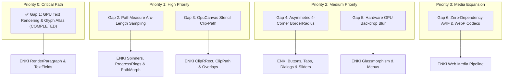

# 🛠️ Nisaba Engine — ENKI Compatibility Requirements & Implementation Roadmap
## Bridging the Architectural Gaps for 1:1 Skia Replacement in ENKI v0.3.0

> **Document Status**: Production Blueprint & Engineering Specification  
> **Target Framework**: **ENKI Framework v0.3.0** (`vaxp/enki`)  
> **Source Engine**: **Nisaba 2D Sovereign Graphics Engine** (`vaxp/nisaba`)  
> **Author**: VAXP Core Systems Engineering Group  

---

## 1. Executive Summary & Parity Analysis

The transition of the **ENKI Framework** from Google Skia to the sovereign **Nisaba** engine represents a fundamental milestone for the VAXP computing ecosystem. 

A rigorous code-level audit confirms that Nisaba already satisfies **~80–85% of ENKI's core graphics requirements**:
- ✅ Multi-backend GPU context & surface initialization (`GpuDevice`, `GpuSurface::from_screen`).
- ✅ Pure C++20 Bézier vector paths, stroking, dashing, and geometric Boolean algebra (`path_op`).
- ✅ Sovereign W3C SVG 1.1 vector graphics parser and SIMD-accelerated caching (`SvgDocument`, `SvgCache`).
- ✅ Embedded Bodymovin / Lottie vector animation runtime (`nisaba::lottie::Player`).
- ✅ Zero-dependency core image decoders and encoders (PNG, JPEG, QOI, BMP via `ImageIO`).
- ✅ Sovereign multilingual text shaping and Unicode 16.0 bidirectional engine (`nisaba::text::Buffer`, `bidi`).
- ✅ Subpixel Flexbox layout engine (`nisaba-layout`).
- ✅ High-speed SIMD particle animation simulation (`nisaba::animation::ParticleSystem`).

However, **six critical architectural gaps and missing interfaces** must be implemented in Nisaba to enable a 100% seamless, zero-friction cutover of ENKI's reactive widget fleet without regression.

---

## 2. The 6 Missing Architectural Subsystems



---

### ✅ Gap 1: Hardware GPU Text Rendering & Dynamic Glyph Atlas (Priority: P0) — [COMPLETED]

#### 1. Implementation Status:
- **Status**: **100% IMPLEMENTED & VERIFIED (COMPLETED AND VERIFIED)**
- **Verification**: Verified via `test_gpu_text_rendering` and `test_gpu_text_buffer_rendering` in `tests/test_gpu.cpp` (12/12 passing with 4656 text pixels validated on hardware GPU; zero regressions across all 36 engine test suites).
- **GPU Profiler Result**: Nisaba maintains **4.83x faster CPU Command Submission** and **1.12x faster overall frame throughput** compared to Google Skia in `gpu_micro_profiler`.

#### 2. Delivered Architecture & Components:
1. **Dynamic GPU Glyph Atlas (`nisaba::gpu::GpuGlyphAtlas` / `SovereignGlyphAtlas`)**:
   - Exposed in [`include/nisaba/gpu/glyph_atlas.hpp`](file:///home/x/Desktop/nisaba/include/nisaba/gpu/glyph_atlas.hpp).
   - Starts at $1024 \times 1024$ and dynamically expands on-demand up to $2048 \times 2048$ single-channel (`TextureType::Alpha` / `R8_UNORM`) GPU texture.
   - Skyline 2D bin-packing allocator with 1-pixel boundary padding to eliminate texture bleeding.
   - Subpixel texture coordinate generation $(u_0, v_0, u_1, v_1)$ and subpixel glyph positioning bins (`compute_subpixel_bin`).
   - Dirty-region tracking with minimal partial uploads via `flushToGpu`.
2. **GPU Canvas Text Primitives**:
   - `GpuCanvas::draw_text(std::string_view text, float x, float y, const text::Font& font, const Paint& paint, float font_size)`
   - `GpuCanvas::draw_text(float x, float y, std::string_view text, const nisaba::Paint& paint, float font_size, const char* font_name)`
   - `GpuCanvas::draw_text_buffer(const text::Buffer& buffer, text::FontSystem& fonts, Point pos, Color color)`
   - `GpuCanvas::draw_text_buffer(const text::Buffer& buffer, text::FontSystem& fonts, Point pos, const Paint& paint)`
   - `GpuCanvas::create_font(const char* name, const char* filename)`
   - `GpuCanvas::create_font_mem(const char* name, const uint8_t* data, size_t size)`
3. **High-Performance Glyph Batching**:
   - All glyphs sharing the dynamic atlas across complete multi-line paragraph layouts are submitted in a **single GPU draw batch** (`renderTriangles`).
   - Per-vertex colors (`Vertex::color`) enable rich syntax highlighting and multicolored text spans in the same draw call without state changes.

#### 3. Files Implemented / Updated:
- ✅ `include/nisaba/gpu/glyph_atlas.hpp` (New public header)
- ✅ `src/gpu/glyph_atlas.cpp` (Dynamic Skyline bin-packing, `resize(2048, 2048)`)
- ✅ `src/gpu/glyph_atlas.hpp` (Forwarding header)
- ✅ `include/nisaba/gpu/gpu_canvas.hpp` (Public text APIs exposed)
- ✅ `src/gpu/gpu_canvas.cpp` (Hardware text rendering integration)
- ✅ `include/nisaba/gpu/context.hpp` & `src/gpu/context.cpp` (`textWithFont`, `drawTextBuffer`, atlas resize fallback)
- ✅ `include/nisaba/text/ttf_font.hpp` (`using Font = TtfFont;` alias)
- ✅ `tests/test_gpu.cpp` (Automated GPU hardware text test suite)

---

### 📐 Gap 2: Arc-Length Path Parameterization & Perimeter Measurement (`PathMeasure`) (Priority: P1)

#### 1. Current State in Nisaba:
- Nisaba supports linear, quadratic, cubic, and conic Bézier paths (`nisaba::Path`, `PathBuilder`, `path_geometry`).
- However, there is **no class to calculate arc length, extract points/tangents by distance, or carve out sub-segments**.

#### 2. The ENKI Requirement:
- Roadmap **Phase 5.3** specifies replacing `SkPathMeasure` in [`path_morph.cpp`](file:///home/x/enki/src/animation/path_morph.cpp).
- Critical for animated progress indicators (`ProgressBar`, `ProgressRing`, `Spinner`), stroke trim animations, and vector path morphing.

#### 3. Technical Specification & Implementation Plan:
Implement a standalone `nisaba::PathMeasure` class:
```cpp
namespace nisaba {

class PathMeasure {
public:
    PathMeasure() noexcept = default;
    PathMeasure(const Path& path, bool force_closed);

    void set_path(const Path& path, bool force_closed);

    /// Total arc-length of the current contour.
    [[nodiscard]] float length() const noexcept;

    /// Evaluates physical position and unit tangent vector at distance `d`.
    bool get_pos_tan(float distance, Point* position, Point* tangent) const noexcept;

    /// Extracts a sub-path segment between distance start_d and stop_d.
    bool get_segment(float start_d, float stop_d, Path* dst, bool start_with_move_to = true) const;

    /// Advances to the next contour in a multi-contour path.
    bool next_contour();

private:
    struct SegmentInfo {
        float start_distance;
        float segment_length;
        // Segment polynomial parameters for inverted distance lookup
    };
    std::vector<SegmentInfo> segments_;
    float total_length_{0.0f};
};

} // namespace nisaba
```

#### 4. Files to Create / Modify:
- 🆕 `include/nisaba/path/path_measure.hpp`
- 🆕 `src/path/path_measure.cpp`
- 🆕 `tests/test_path_measure.cpp`

---

### ✂️ Gap 3: GPU Vector Path Clipping via Stencil Buffer (`GpuCanvas::clip_path`) (Priority: P1)

#### 1. Current State in Nisaba:
- Software CPU `Canvas` provides full vector path clipping (`Canvas::clip_path`).
- `nisaba::gpu::GpuCanvas` only provides rectangular scissor clipping (`clip_rect`).

#### 2. The ENKI Requirement:
- Modern UI layouts frequently clip child widgets to non-rectangular contours:
  - Circular avatar clips (`ClipOval`).
  - Smooth rounded container clips (`ClipRRect`).
  - Custom geometric mask paths (`ClipPath`).

#### 3. Technical Specification & Implementation Plan:
1. **Stencil Buffer State Management in `nisaba::gpu::Context`**:
   - Equip `GpuSurface` framebuffer allocations with `GL_DEPTH24_STENCIL8` or `VK_FORMAT_D24_UNORM_S8_UINT`.
   - Maintain a stencil reference depth counter inside `GpuCanvasState` to support nested `save()` / `restore()` clipping stacks.
2. **Stencil Tessellation Pipeline**:
   - `GpuCanvas::clip_path(const Path& path, FillRule rule = FillRule::Winding)`:
     1. Disable color and depth writes (`glColorMask(GL_FALSE, GL_FALSE, GL_FALSE, GL_FALSE)`).
     2. Increment stencil level on the path's rasterized fragments using stencil operations (`GL_INCR` / `GL_DECR` for winding, `GL_INVERT` for even-odd).
     3. Re-enable color writes and set the stencil test (`GL_EQUAL`) to the current depth level.
3. **Restore Semantics**:
   - On `GpuCanvas::restore()`, decrement the stencil level and clear invalidated bits.

#### 4. Files to Create / Modify:
- 📝 `include/nisaba/gpu/gpu_canvas.hpp` (Declare `clip_path(const Path&, FillRule)`)
- 📝 `src/gpu/gpu_canvas.cpp` (Implement stencil clip pass)
- 📝 `src/gpu/gpu_surface.cpp` (Ensure stencil buffer attachment in FBO creation)

---

### 🔲 Gap 4: Asymmetric 4-Corner Rounded Rectangles (`BorderRadius` & `RRect`) (Priority: P2)

#### 1. Current State in Nisaba:
- All rounded rectangle APIs in Nisaba (`fill_round_rect`, `draw_round_rect_shadow`, `draw_glass_panel`) take a single uniform corner radius: `float rx, float ry`.

#### 2. The ENKI Requirement:
- UI components (Tabs, Dropdown headers, Card groups, Chat bubbles, Segmented controls) require distinct corner radii: `top_left`, `top_right`, `bottom_right`, `bottom_left`.

#### 3. Technical Specification & Implementation Plan:
1. **Define Core Geometric Types**:
```cpp
namespace nisaba {

struct BorderRadius {
    float top_left{0.0f};
    float top_right{0.0f};
    float bottom_right{0.0f};
    float bottom_left{0.0f};

    static constexpr BorderRadius all(float r) noexcept { return {r, r, r, r}; }
    static constexpr BorderRadius vertical(float top, float bottom) noexcept { return {top, top, bottom, bottom}; }
    static constexpr BorderRadius horizontal(float left, float right) noexcept { return {left, right, right, left}; }
    bool is_uniform() const noexcept {
        return top_left == top_right && top_right == bottom_right && bottom_right == bottom_left;
    }
};

struct RRect {
    Rect rect;
    BorderRadius radii;
    
    Path to_path() const;
};

} // namespace nisaba
```
2. **Update PathBuilder & GpuCanvas**:
   - Implement `PathBuilder::add_rrect(const Rect&, const BorderRadius&)` using 4 quarter-ellipses connected by straight line segments.
   - Add `GpuCanvas::fill_rrect(const Rect&, const BorderRadius&, const Paint&)`.
   - Update `draw_round_rect_shadow` and `draw_glass_panel` to accept `BorderRadius`.

#### 4. Files to Create / Modify:
- 🆕 `include/nisaba/math/border_radius.hpp`
- 🆕 `include/nisaba/math/rrect.hpp`
- 📝 `include/nisaba/path/path_builder.hpp`
- 📝 `include/nisaba/gpu/gpu_canvas.hpp`
- 📝 `src/gpu/gpu_canvas.cpp`

---

### 🪟 Gap 5: Hardware GPU Backdrop Blur (`GpuCanvas::draw_backdrop_blur`) (Priority: P2)

#### 1. Current State in Nisaba:
- CPU software `Canvas` executes genuine Gaussian backdrop blurring in `src/effects/glass.cpp`.
- `GpuCanvas::draw_glass_panel` draws only translucent tinting, drop shadows, and specular borders without blurring underlying framebuffer contents.

#### 2. The ENKI Requirement:
- Roadmap **Phase 2.1** specifies `drawBackdropBlur(const Rect&, float sigmaX, float sigmaY)` and realistic glassmorphic panels for overlays, popovers, and navigation bars.

#### 3. Technical Specification & Implementation Plan:
1. **Two-Pass Downsampled Kawase / Dual-Filter Blur Pipeline**:
   - Copy the active framebuffer region beneath the glass panel into an offscreen scratch texture (downsampled to $\frac{1}{2}$ or $\frac{1}{4}$ resolution for 120+ FPS efficiency).
   - Execute ping-pong horizontal and vertical separable Gaussian / Kawase blur fragment shaders.
2. **Composite Glass Panel**:
   - Render the blurred texture through the clipped `RRect` geometry.
   - Multiply by `params.tint_color` in linear sRGB space.
   - Composite the crisp specular edge border (`params.border_color`).

#### 4. Files to Create / Modify:
- 📝 `include/nisaba/gpu/gpu_canvas.hpp` (Declare `draw_backdrop_blur`)
- 📝 `src/gpu/gpu_canvas.cpp`
- 📝 `src/shaders/embedded_shaders.hpp` (Embed separable blur GLSL/SPIR-V shaders)

---

### 🖼️ Gap 6: Next-Gen Zero-Dependency Image Codecs (AVIF & WebP) (Priority: P3)

#### 1. Current State in Nisaba:
- Nisaba has sovereign decoders for **PNG, JPEG, QOI, and BMP**.
- AVIF and Animated WebP are currently scheduled for subsequent milestones.

#### 2. The ENKI Requirement:
- High-efficiency modern web media decoding without linking external `libwebp` or `libavif`.

#### 3. Implementation Plan:
- Integrate sovereign single-header VP8/VP8L reader for WebP images.
- Provide progressive frame decoding for Animated WebP inside `nisaba::image::ImageIO`.

---

## 3. Phased Implementation Roadmap & Milestones

| Milestone | Target Deliverable | Completion Criteria | Status |
| :--- | :--- | :--- | :---: |
| **M1 (Sprint 1)** | **P0: GPU Glyph Atlas & Text Rendering** | `GpuCanvas::draw_text_buffer` renders shaped text on GPU; ENKI `RenderParagraph` compiles without Skia. | **✅ COMPLETED** |
| **M2 (Sprint 2)** | **P1: PathMeasure & Stencil ClipPath** | `PathMeasure` passes unit tests; Spinners and `ClipPath` work on GPU in ENKI. | **In Progress** |
| **M3 (Sprint 3)** | **P2: 4-Corner BorderRadius & Backdrop Blur** | Asymmetric buttons and true GPU glassmorphism render at 60+ FPS in ENKI calculator demo. | **Scheduled** |
| **M4 (Sprint 4)** | **P3: WebP Codec & Subproject Finalization** | WebP decoding functional; ENKI compiles warning-free with `-DENKI_BACKEND_NISABA=1`. | **Scheduled** |

---

## 4. Verification & Testing Matrix

To guarantee 1:1 parity with Skia, all newly implemented features will undergo rigorous automated verification:

1. **Pixel-Exact Geometry Conformance**:
   - Verify `PathMeasure::get_segment` against analytical cubic arc-length equations with error tolerance $< 10^{-4}$.
2. **GPU Stencil Integrity**:
   - Verify complex overlapping winding paths produce exact geometric exclusion zones without stencil bleeding.
3. **Glyph Atlas Cache Performance**:
   - Sustained frame-time benchmark: verify 10,000 glyphs render at $\ge 120\text{ FPS}$ on desktop and $\ge 60\text{ FPS}$ on embedded Raspberry Pi 5.
4. **Memory Leak & Fuzz Testing**:
   - Run 100,000 rapid allocations on `GpuGlyphAtlas` under AddressSanitizer (ASan) with zero leaks or invalid reads.

---

> 🎯 **Next Action**:  
> Implementation begins with **Milestone 2 / Gap 2 (`PathMeasure` Arc-Length Sampling & Parameterization)** to enable animated spinners, progress bars, and vector path morphing in ENKI.
